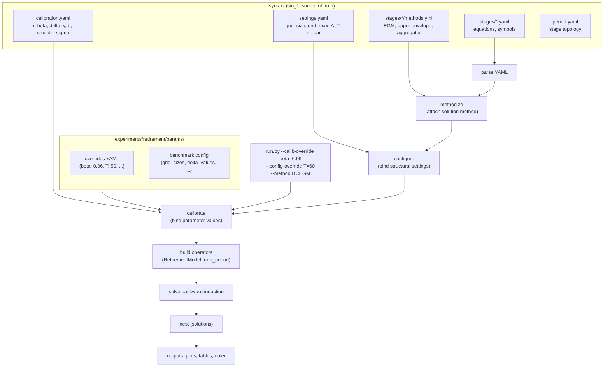

# Retirement Pipeline-First Restructure

## 1. Problem

`run_experiment.py` bypasses the dolo-plus pipeline: it manually constructs `RetirementModel(r=..., beta=..., ...)` from a flat params YAML, then passes the pre-built `cp` and `stage_ops` to `backward_induction`. This violates the design principles:

> "Pipeline must be complete: parse -> methodize -> calibrate -> translate -> solve. Never skip steps by loading pre-built artifacts." ([design-principles.md](AI/design-principles.md), line 244)

The canonical pipeline already exists as `solve_canonical` in [solve.py](examples/retirement/solve.py) (line 359-398). It reads `calibration.yaml`, merges overrides, and runs `build_and_solve_nest` which constructs `cp` internally via `RetirementModel.from_period`. But nothing actually calls it.

Meanwhile, calibration values are duplicated in three places:

- `syntax/syntax/calibration.yaml` (the dolo-plus truth)
- `syntax/syntax/settings.yaml` (grid settings, T, m_bar)
- `examples/retirement/params/*.yml` (flat re-statement of the same values)

## 1b. Blocking bugs in current code

**`solve_canonical` is broken for the full parameter set.** It loads `settings.yaml` into a separate dict, only extracts `T`, and **never merges** `m_bar`, `grid_size`, `grid_max_A`, etc. into `base_params`. This means `solve_canonical` has never worked end-to-end. This is a blocking bug, not a minor adjustment.

**`build_and_solve_nest` silently freezes `cp`/`stage_ops` from period 0.** The `if cp is None or stage_ops is None` conditional means operators are built once and reused for all `T` periods. This is correct for stationary models but breaks if `params` is a schedule. Document this as an explicit stationarity assumption.

**Default value conflicts across files:**

| Parameter | `__init__` default | `run_experiment.py` | `benchmark.py` | Canonical? |
|-----------|-------------------|---------------------|-----------------|------------|
| `beta`    | 0.945             | 0.98                | 0.96            | **TBD — must resolve** |
| `T`       | 60                | 50                  | 50              | **TBD — must resolve** |
| `b`       | 1e-2              | 1e-10               | 1e-100          | **TBD — must resolve** |

These must be reconciled into `calibration.yaml` **before** any pipeline work (Step 0).

## 2. Target Architecture



### Key decisions

- **`syntax/` is the config, not optional.** It contains the canonical calibration and stage declarations. The double nesting `syntax/syntax/` should be flattened to just `syntax/`.
- **`examples/retirement/params/` goes away.** Baseline lives in `syntax/calibration.yaml` + `syntax/settings.yaml`. Experimental overrides live in `experiments/retirement/params/`.
- **Three-functor override mechanism (matsya review).** DDSL prescribes three distinct functors applied in order: methodize, configure, calibrate. The current plan's single `params_override` dict conflates all three. `solve_canonical` should accept separate override hooks:

    ```python
    solve_canonical(syntax_dir,
        method_overrides={'work_cons': {'solver': 'dcegm'}},
        config_overrides={'T': 60, 'grid_size': 5000},
        calib_overrides={'beta': 0.96})
    ```

    Each override is consumed at the correct pipeline stage. CLI flags map to the appropriate override dict.
- **`benchmark.py` also uses the pipeline**: instead of manually constructing `RetirementModel(...)` per grid/delta combo, it calls `solve_canonical(...)` in a loop.
- **`backward_induction` must be deleted**, not just bypassed. It exists solely to enable the bypass pattern. If retained "for convenience," the pipeline will be bypassed again within months.

## 3. What changes in each file

### 3.1 `run.py` (was `run_experiment.py`)

**Before** (lines 139-153):

```python
cp = RetirementModel(r=params.get('r', 0.02), beta=..., ...)
movers = Operator_Factory(cp)
# ... then backward_induction(cp, movers, SYNTAX_DIR, method=method)
```

**After**:

```python
nest, cp = solve_canonical(SYNTAX_DIR,
    calib_overrides=calib_overrides,
    config_overrides=config_overrides,
    method_overrides=method_overrides)
```

The CLI changes:

- Remove `--params` (no more flat params files)
- Add `--calib-override key=value` (repeatable, for economic params: `beta`, `delta`, etc.)
- Add `--config-override key=value` (repeatable, for numerical params: `grid_size`, `T`, etc.)
- Add `--override-file path.yml` (for experiment configs from `experiments/`)
- Keep `--method` as convenience flag (maps to `method_overrides`)
- Keep `--grid-size`, `--plot-age`, `--output-dir` as convenience flags
- `--grid-size N` becomes shorthand for `--config-override grid_size=N`
- **Type coercion**: use `yaml.safe_load(value)` for each CLI override value to handle int/float/bool naturally

### 3.2 `benchmark.py`

Currently manually constructs `RetirementModel(...)` for each grid/delta config (lines 81-93, 110-122). Should instead call `solve_canonical` with overrides:

```python
nest, cp = solve_canonical(SYNTAX_DIR,
    params_override={'grid_size': g_size, 'delta': delta, ...},
    method=method)
```

### 3.3 Syntax directory flattening

Flatten `syntax/syntax/` to `syntax/`:

```
examples/retirement/syntax/
├── calibration.yaml          # r, beta, delta, y, b, smooth_sigma (economic params)
├── settings.yaml             # grid_size, grid_max_A, T, m_bar, padding_mbar (numerical settings)
├── period.yaml               # stage topology
└── stages/                   # stage declarations
    ├── labour_mkt_decision/
    ├── work_cons/
    └── retire_cons/
```

Currently the double nesting exists because of a `.gitkeep` at the outer level. Just move files up one level.

**Grep audit checklist** (must be run after flattening):
- `grep -r "syntax/syntax" .` (string literals)
- `grep -r '"syntax".*"syntax"' .` (Path constructions)
- `grep -r "SYNTAX_DIR" .` (variable references — both `run_experiment.py` and `benchmark.py` currently define this)

### 3.4 `examples/retirement/params/` -> `experiments/retirement/params/`

Delete `examples/retirement/params/`. The experiment override files should be **sparse** — only the values that differ from baseline:

```yaml
# experiments/retirement/params/high_beta.yml
overrides:
  beta: 0.99
```

```yaml
# experiments/retirement/params/sweep_baseline.yml
overrides:
  beta: 0.96
  T: 50
benchmark:
  true_grid_size: 20000
  true_method: DCEGM
```

The current files duplicate the entire calibration; they should only contain deltas.

### 3.5 `solve.py` adjustments

**Blocking bug:** `solve_canonical` loads `settings.yaml` into a separate dict and only extracts `T`. It never merges `m_bar`, `grid_size`, `grid_max_A`, etc. into `base_params`. This is why `solve_canonical` has never worked end-to-end.

**Three-functor split (matsya review).** Instead of a single `merged_params` blob, `solve_canonical` should apply the three functors in order:

```python
def solve_canonical(syntax_dir, method_overrides=None,
                    config_overrides=None, calib_overrides=None):
    syntax_dir = Path(syntax_dir)

    # Phase 1: Parse — load stage YAMLs
    stages = load_stage_yamls(syntax_dir)

    # Phase 2: Methodize — attach solution methods
    # method is a methodization concern, not a parameter
    stages = {name: methodize(s, method_overrides) for name, s in stages.items()}

    # Phase 3: Configure — bind structural/grid settings
    settings = load_settings(syntax_dir / "settings.yaml")
    if config_overrides:
        settings.update(config_overrides)
    stages = {name: configure(s, settings) for name, s in stages.items()}

    # Phase 4: Calibrate — bind economic parameter values
    calibration = load_calibration(syntax_dir / "calibration.yaml")
    if calib_overrides:
        calibration.update(calib_overrides)
    stages = {name: calibrate(s, calibration) for name, s in stages.items()}

    # Phase 5: Build and solve
    T = settings.get('T', calibration.get('T', 20))
    period = build_period_from_stages(stages)
    return build_and_solve_nest(T, period, syntax_dir)
```

Each override dict is consumed at the correct pipeline stage. This preserves the DDSL separation: methodization != configuration != calibration.

**Verify `calibrate_stage` accepts merged params** (Step 2.5). If `calibrate_stage` chokes on numerical params like `grid_size` or `grid_max_A` that it doesn't expect, the merge strategy needs adjustment (filter params before passing to dolo-plus, keep full dict for `RetirementModel`).

**Delete `backward_induction`** (Step 6.5). It exists solely to enable the bypass pattern. After the restructure, it is dead code.

**Return signature.** Change `solve_canonical` to return `(nest, cp, stage_ops)` so callers don't need to dig into nest internals for operators. Or return a `SolveResult` namedtuple.

### 3.6 `model.py` — `RetirementModel.from_period` cleanup

**DDSL violation (matsya review):** After the calibrate functor has been applied, each stage carries its own calibrated parameters. The solve layer (`RetirementModel`) should not reach back into stage internals to extract calibration. Currently `from_period` reads `period['work_cons'].calibration` directly — this couples the solve layer to stage internals.

**Fix:** The period object, post-calibration, should expose period-level config:

```python
# from_period reads from period-level attributes, not stage internals
@classmethod
def from_period(cls, period, equations=None):
    config = period.config      # set during configure phase
    cal = period.calibration    # set during calibrate phase
    return cls(
        r=cal['r'], beta=cal['beta'], ...
        grid_size=config['grid_size'], T=config['T'], ...
    )
```

If this requires a period-level config aggregation step, add it to `build_period`.

**`padding_mbar` gap:** `RetirementModel.__init__` accepts `padding_mbar` but `from_period` never passes it — it silently defaults to 0. Add `padding_mbar` to `settings.yaml` and wire it through `from_period`.

### 3.7 `model.py` — Operator signature cleanup (matsya review)

**Config leaks into operator signatures.** DDSL stage operators are pure value-function-to-value-function maps. Configuration should be bound during earlier pipeline stages:

- `t` in `solver_retiree_stage` — time index should be handled by the period-level backward loop, not passed as an operator argument. The stage operator is time-agnostic.
- `method` in `solver_worker_stage` — solution method should be bound during the **methodize** functor, not at call time.

**Fix:** Bind `t` and `method` during operator construction in `Operator_Factory`, not at call time.

**Debug values in `work_cons` return.** The 8-tuple return `(v, c, da, ue_time, c_hat, q_hat, egrid, da_pre_ue)` mixes clean operator outputs with solver diagnostics. DDSL operators should return only the ValueFn bundle. Diagnostics should go through a separate mechanism (e.g. `stage_ops['work_cons'].diagnostics` dict, or a debug callback).

**Inconsistent ValueFn representation across stages (matsya review):**

| Stage | Current return | Correct canonical return |
|-------|---------------|------------------------|
| `retire_cons` | `(c, v, da, dlambda)` | `(v, c, da, dlambda)` |
| `work_cons` | `(v, c, da, ue_time, c_hat, ...)` | `(v, c, da, dlambda)` |
| `labour_mkt_decision` | `(v, c, lambda, dlambda)` | `(v, c, da, dlambda)` |

All stages should return the same canonical bundle: `(v_arvl, c_arvl, da_arvl, dlambda_arvl)`.

**Inconsistent perch tagging (matsya review).** `retire_cons` correctly uses `_cntn`/`_arvl` suffixes. `work_cons` uses `_cntn` on inputs but no perch tags on outputs. `labour_mkt_decision` uses branch labels (`_work`, `_ret`) on inputs. All variables should carry their perch tag consistently.

### 3.8 `model.py` — `RetirementModel.__init__` defaults

After the restructure, `RetirementModel.__init__`'s default parameter values become a **second source of truth** that can drift from `calibration.yaml`. Options:

- **(a) Remove defaults** — make all params required. Enforces `calibration.yaml` as sole truth.
- **(b) Add `RetirementModel.with_defaults()`** classmethod that explicitly loads from `calibration.yaml`.
- **(c) Accept the dual-source risk** — document that defaults are for testing only.

Recommend **(a)** for production, with a `with_test_defaults()` classmethod for unit tests.

### 3.9 Naming standardization

| Current | Proposed | Rationale |
|---------|----------|-----------|
| `movers` (run_experiment.py) | `stage_ops` | Consistent with solve.py |
| `cp` | `model` | `cp` is opaque ("calibration parameters"?) |
| `build_and_solve_nest` | `_build_and_solve_nest` | Internal; `solve_canonical` is the public API |

## 4. Parameter flow (after — three-functor model)

```
stages/*.yaml ──────> parse ──> SymbolicModel per stage
methods.yml ────────> methodize ──> attach solver (EGM, UE, max)   ← method_overrides
settings.yaml ──────> configure ──> bind grid/T/m_bar              ← config_overrides
calibration.yaml ───> calibrate ──> bind r/beta/delta/y/b          ← calib_overrides
                          │
                          v
                    calibrated period ──> RetirementModel.from_period(period)
                                     ──> Operator_Factory(model)
                                     ──> build_and_solve_nest()
```

Each functor consumes its own file and override dict. Parameters flow through the pipeline at the correct abstraction level:

| Functor | File | Contains | Override dict |
|---------|------|----------|---------------|
| **methodize** | `stages/*/methods.yml` | EGM, upper envelope, aggregator choice | `method_overrides` |
| **configure** | `settings.yaml` | `grid_size`, `grid_max_A`, `T`, `m_bar`, `padding_mbar` | `config_overrides` |
| **calibrate** | `calibration.yaml` | `r`, `beta`, `delta`, `y`, `b`, `smooth_sigma` | `calib_overrides` |

The calibrate functor only picks params declared in each stage's `parameters:` list. Period-level config (from configure) and calibration are both available to `RetirementModel.from_period` via the period object — not via a separate merged dict.

## 5. Calibration.yaml and settings.yaml — keep separate (confirmed)

**Keep `calibration.yaml` and `settings.yaml` separate.** This is not just the dolo-plus convention — it reflects the three-functor pipeline where they are consumed at different stages:

- `settings.yaml` is consumed by the **configure** functor (structural/grid settings)
- `calibration.yaml` is consumed by the **calibrate** functor (economic parameter values)

Do **not** merge them into a single blob before passing into the pipeline — that conflates the two abstraction levels. The override mechanism provides separate hooks for each.

**Note (matsya review):** A `methods.yaml` per stage is also part of the three-functor model, consumed by the **methodize** functor. This already exists as `stages/*/methods.yml` files in the current code.

## 6. What needs to move into `calibration.yaml` / `settings.yaml`

Currently missing from the dolo-plus config but present in `params/*.yml`:


| Parameter                  | Currently in              | Should go in                              |
| -------------------------- | ------------------------- | ----------------------------------------- |
| `b` (borrowing constraint) | params YAML only          | `calibration.yaml`                        |
| `grid_max_A`               | params YAML only          | `settings.yaml` (or `calibration.yaml`)   |
| `grid_size`                | params YAML only          | `settings.yaml` (as `n_w` already exists) |
| `smooth_sigma`             | params YAML only          | `calibration.yaml`                        |
| `padding_mbar`             | hardcoded in benchmark.py | `settings.yaml`                           |


Note: `settings.yaml` already has `n_w`, `w_min`, `w_max` but these are the grid params for the dolo pipeline stages. `grid_size` / `grid_max_A` are used by `RetirementModel` to construct the arrival asset grid. These need to be reconciled — ideally `n_w` = `grid_size` and `w_max` derives from `grid_max_A`.

## 7. Inter-period twister (matsya review)

The current twister `{b: a, b_ret: a_ret}` is structurally correct — it maps cntn-perch variables to arvl-perch variables across periods. Two concerns from matsya:

**Perch tags.** DDSL convention requires perch-tagged names: `{b_arvl: a_cntn, b_ret_arvl: a_ret_cntn}`. The current bare names are ambiguous about which perch they belong to.

**Branch-specific state leaking.** `b_ret` as a separate inter-period variable means the retirement branch's state is visible outside its branch scope. This is correct for this model because retirement is an absorbing state (once retired, always retired) — the retiree's wealth track persists independently. Document this as a **two-track state space**, not a simple branch resolution.

## 8. Implementation order

0. **Audit and reconcile all default values** — create a table of every parameter with its value in each location. Resolve conflicts (beta: 0.945/0.98/0.96, T: 20/50/60, b: 1e-2/1e-10/1e-100). This is prerequisite to everything else.
1. **Flatten `syntax/syntax/` to `syntax/`** — file moves, grep-audit all `SYNTAX_DIR` and `syntax/syntax` references.
2. **Add missing params** to `calibration.yaml` and `settings.yaml` (see Section 6 table).
3. **Verify `calibrate_stage` accepts merged params** — smoke test that `build_period()` works when the params dict includes both economic and numerical params. If `calibrate_stage` chokes, filter before passing to dolo-plus.
4. **Split `solve_canonical` into three-functor pipeline** — separate method_overrides, config_overrides, calib_overrides. Return `(nest, model, stage_ops)`.
5. **Clean operator signatures** — remove `t` from `retire_cons`, bind `method` at construction time in `Operator_Factory`, extract debug values from `work_cons` return into diagnostics dict. Standardize all stages to canonical return: `(v_arvl, c_arvl, da_arvl, dlambda_arvl)`.
6. **Update `RetirementModel.from_period`** — read from period-level config/calibration, not stage internals. Wire `padding_mbar`.
7. **Rewrite `run.py`** — call `solve_canonical` with three-functor CLI override mechanism. Type coercion via `yaml.safe_load(value)`.
8. **Rewrite `benchmark.py`** — use `solve_canonical` per sweep config. Consider caching parsed YAML to avoid re-parsing overhead in benchmark loops.
9. **Delete `backward_induction`** — bypass pattern, now dead code.
10. **Move `examples/retirement/params/`** to `experiments/retirement/params/` as sparse overrides. Format: flat key-value YAML, no `calibration:` wrapper.
11. **Remove Python-side default values** from `RetirementModel.__init__` (or add `with_test_defaults()` classmethod). Enforce `calibration.yaml` as sole source of truth.
12. **Update docs and README** references.
13. Smoke test: `python run.py --output-dir results/retirement` (baseline from syntax config).
14. Smoke test: `python run.py --override-file ../../experiments/retirement/params/high_beta.yml`.

## 9. Numba cache optimization (deferred)

The stage operators in `Operator_Factory` (`solver_retiree_stage`, `_invert_euler`, `solver_worker_stage`, `_approx_dcsn_state_functions`, `lab_mkt_choice_stage`) are `@njit` closures that capture calibration scalars and the asset grid. Numba cannot cache closure-based jitted functions — they recompile on every `Operator_Factory` call.

**Quick win (done)**: added `cache=True` to the four module-level utility functions (`_default_u`, `_default_du`, `_default_uc_inv`, `_default_ddu`).

**Larger refactor (for this devspec)**: convert closures to module-level `@njit(cache=True)` functions that take parameters explicitly. `Operator_Factory` becomes a thin dict that partially applies them via lambdas or `functools.partial` (non-jitted wrapper). This eliminates recompilation across calls and enables disk caching. Example:

```python
@njit(cache=True)
def _solve_retiree(c_cntn, v_cntn, dlambda_cntn, t,
                   beta, R, grid_size, asset_grid_A, u, du, uc_inv, ddu):
    ...

def Operator_Factory(cp):
    def retire_cons(c, v, ddv, t):
        return _solve_retiree(c, v, ddv, t, cp.beta, cp.R, ...)
    return {'retire_cons': retire_cons, ...}
```

## 10. Implementation risks

| Risk | Severity | Mitigation |
|------|----------|------------|
| Step 1 (flatten syntax/) breaks YAML path references | **Highest** | Grep audit before and after |
| `calibrate_stage` chokes on numerical params mixed in | **High** | Step 3 smoke test before proceeding |
| CLI `--override key=value` type coercion | **Medium** | Use `yaml.safe_load(value)` |
| `benchmark.py` performance regression (re-parsing YAML per call) | **Medium** | Cache parsed YAML or pass pre-loaded dicts |
| Override file format ambiguity | **Medium** | Mandate flat key-value, validate in `solve_canonical` |
| `equations` / callables flow not specified for non-log utility | **Low** | Document as "not yet supported; whisperer will handle" |

## 10. Matsya review sources

Review conducted via `econ-ark-matsya` (bellman-ddsl RAG, Claude Opus 4.6 with extended thinking). Key retrieved context:

- `bellman-ddsl/AI/prompts/AAS/12012026/decorators.md` — DDSL pipeline stages and functor ordering
- `bellman-ddsl/AI/prompts/AAS/11112025/make-doland-modular-explore.md` — stage self-containment principle
- `bellman-ddsl/AI/prompts/AAS/03012025/cii-prompts/stage-morphisms.md` — stage operator signatures, perch tagging
- `bellman-ddsl/AI/prompts/AAS/25022026/spec-0.1l-implementation-plan.md` — canonical pipeline implementation
- `bellman-ddsl/docs/examples/retirement_choice.md` — retirement model stage structure

