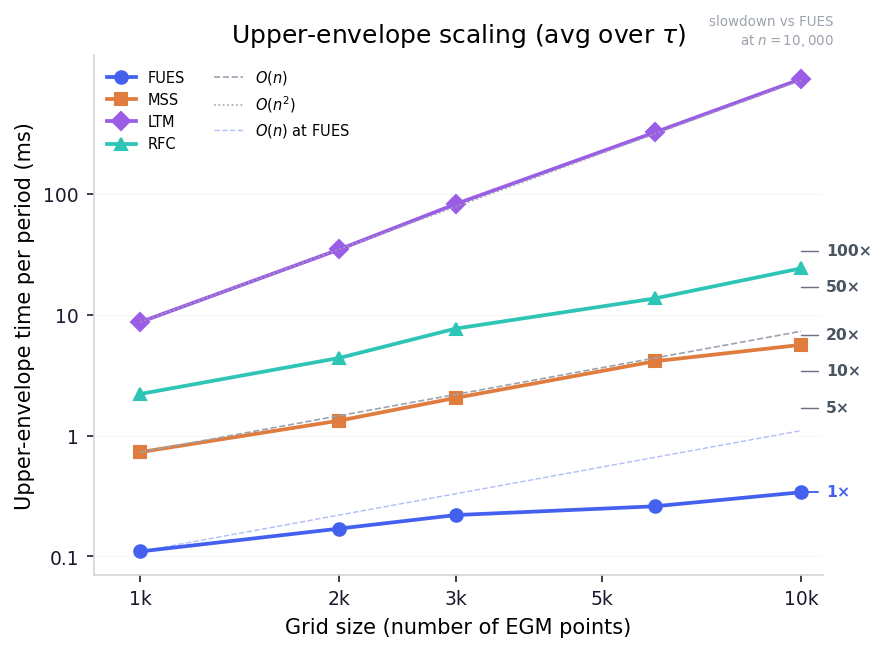

# Fast Upper-Envelope Scan (FUES)

> **Pre-release (v0.6.0dev1)** — Under active development. The API and docs may change.

> Dobrescu, L.I. and Shanker, A. (2022). "A fast upper envelope scan method for discrete-continuous dynamic programming." [SSRN Working Paper.](https://papers.ssrn.com/sol3/papers.cfm?abstract_id=4181302)

FUES recovers the upper envelope of the EGM ([Carroll 2006](https://doi.org/10.1016/j.econlet.2005.09.013)) value correspondence in discrete-continuous problems. FUES does not require monotonicity of the optimal policy function or numerical optimisation. FUES is also orders of magnitude faster than existing upper envelope methods. 

<p align="center">
  
</p>
<p align="center"><em>PBS cluster timings (NCI Gadi): upper-envelope time vs grid size across methods.</em></p>

This repo also ships a unified upper-envelope interface (`uenvelope`) that dispatches to FUES as well as key benchmark upper envelope methods including the monotone segment selection (MSS, algorithm by [Iskhakov et al. 2017](https://doi.org/10.3982/QE643)) and local triangulation (LTM, [Druedahl & Jørgensen 2017](https://doi.org/10.1016/j.jedc.2016.11.005)).

**[Docs](https://akshayshanker.github.io/FUES/)** · **[Notebooks](https://akshayshanker.github.io/FUES/notebooks/retirement_fues/)** 

## Install

The installable package containing `fues` and `uenvelope` modules is `dcsmm`. Requires Python 3.11+.
### Option 1: Library only

Install FUES and the upper-envelope interface without cloning the repo. Lets you use `fues` and all other benchmark upper envelope methods in your own applications. 

```bash
pip install git+https://github.com/akshayshanker/FUES.git
```

```python
from dcsmm.fues import FUES
from dcsmm.uenvelope import EGM_UE
```

Runtime dependencies (numba, numpy, scipy, [HARK](https://github.com/econ-ark/HARK), [ConSav](https://github.com/NumEconCopenhagen/ConsumptionSaving)) are installed automatically. See `pyproject.toml` for the full list and version pins.

### Option 2: With examples

Clone the repo and install with example dependencies (`matplotlib`, `pyyaml`, `seaborn`, [`kikku`](https://github.com/bright-forest/kikku)). Includes everything in Option 1 plus the example models in the repo checkout.

```bash
git clone https://github.com/akshayshanker/FUES.git
cd FUES
pip install ".[examples]"
```


Each example can be run as a simple single solve via `run.py`

```bash
python examples/retirement/run.py --grid-size 3000
```

See the [retirement example docs](https://akshayshanker.github.io/FUES/examples/retirement/) for details on CLI arguments, parameter overrides, and outputs.

Formal benchmarking and parameter sweeps are run on an HPC cluster using the PBS scripts in [`experiments/retirement/`](experiments/retirement/). Pre-computed paper results (tables and figures) are in [`replication/`](replication/).

The [interactive notebook](examples/retirement/notebooks/retirement_fues.ipynb) walks through the retirement model step by step, including EGM grid inspection, method comparison, and scaling analysis.

### Option 3: Developer (editable)

Full setup with editable install, examples, and all dependencies including the dolo-plus compiler. Use this if you are modifying the source.

```bash
git clone https://github.com/akshayshanker/FUES.git
cd FUES
bash setup/setup_venv.sh
source .venv/bin/activate
```

This creates a local `.venv`, installs `dcsmm` in editable mode, and verifies the install.

Run the full timing sweep:

```bash
python examples/retirement/run.py --run-timings
```

## Package layout

### Core modules

- **FUES** (`src/dcsmm/fues/`) — Fast Upper-Envelope Scan algorithm + rooftop-cut (RFC).
- **Upper-envelope registry** (`src/dcsmm/uenvelope/`) — unified entry point dispatching to FUES, MSS, RFC, or LTM.

### External methods wrapped by `uenvelope`

| Package | Method | Reference |
|---------|--------|-----------|
| [HARK](https://github.com/econ-ark/HARK) | MSS | [Iskhakov et al. (2017)](https://doi.org/10.3982/QE643) |
| [ConSav](https://github.com/NumEconCopenhagen/ConsumptionSaving) | LTM | [Druedahl & Jørgensen (2017)](https://doi.org/10.1016/j.jedc.2016.11.005) |
| Native | RFC | [Dobrescu & Shanker (2024)](https://papers.ssrn.com/sol3/papers.cfm?abstract_id=4850746) |

### Directory structure

```
FUES/
├── src/dcsmm/            # installable package
│   ├── fues/             # FUES + variants
│   └── uenvelope/        # upper-envelope registry
├── examples/
│   ├── retirement/       # retirement choice (+ notebooks/)
│   ├── durables/         # durables with adjustment frictions
│   └── housing_renting/  # discrete housing + capital tax
├── experiments/          # PBS/HPC scripts with param overrides
├── replication/          # paper tables + figures (committed outputs)
├── setup/                # setup_venv.sh, load_env.sh
└── docs/                 # mkdocs site
```

## References

- Carroll, C.D. (2006). "The method of endogenous gridpoints for solving dynamic stochastic optimization problems." *Economics Letters*, 91(3), 312–320.
- Dobrescu, L.I. and Shanker, A. (2024). "Using Inverse Euler Equations to Solve Multidimensional Discrete-Continuous Dynamic Models: A General Method." *SSRN Working Paper No. 4850746*.
- Dobrescu, L.I. and Shanker, A. (2022). "A fast upper envelope scan method for discrete-continuous dynamic programming." *SSRN Working Paper No. 4181302*.
- Druedahl, J. and Jørgensen, T.H. (2017). "A general endogenous grid method for multi-dimensional models with non-convexities and constraints." *Journal of Economic Dynamics and Control*, 74, 87–107.
- Druedahl, J. (2021). "A guide on solving non-convex consumption-saving models." *Computational Economics*, 58, 747–775.
- Fella, G. (2014). "A generalized endogenous grid method for non-smooth and non-concave problems." *Review of Economic Dynamics*, 17(2), 329–344.
- Iskhakov, F., Jørgensen, T.H., Rust, J. and Schjerning, B. (2017). "The endogenous grid method for discrete-continuous dynamic choice models with (or without) taste shocks." *Quantitative Economics*, 8(2), 317–365.
