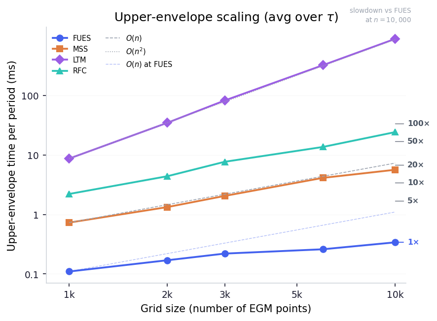

<p align="center">
  <strong>Fast Upper-Envelope Scan (FUES)</strong>
</p>

<p align="center">
  <a href="https://akshayshanker.github.io/FUES/">Docs</a> ·
  <a href="https://akshayshanker.github.io/FUES/notebooks/retirement_fues/">Notebooks</a> ·
  <a href="https://papers.ssrn.com/sol3/papers.cfm?abstract_id=4181302">Paper</a>
</p>

---

FUES recovers the upper envelope of the EGM ([Carroll
2006](https://doi.org/10.1016/j.econlet.2005.09.013)) value correspondence in
discrete-continuous problems without requiring monotonicity of the optimal
policy or numerical optimisation. FUES can also perform orders of magnitude
faster than existing upper-envelope methods.

<p align="center">
  
</p>

This repo ships the FUES algorithm described in the paper and a unified
upper-envelope interface (`uenvelope`) that dispatches to FUES and other upper
envelope methods: MSS ([Iskhakov et al. 2017](https://doi.org/10.3982/QE643)),
LTM ([Druedahl & Jørgensen 2017](https://doi.org/10.1016/j.jedc.2016.11.005)),
and RFC ([Dobrescu & Shanker
2024](https://papers.ssrn.com/sol3/papers.cfm?abstract_id=4850746)).

> **Pre-release (v0.6.0dev8)** — Under active research development. API may
> change.
>
> Dobrescu, L.I. and Shanker, A. (2022). "A fast upper envelope scan method
> for discrete-continuous dynamic programming." [SSRN Working
> Paper.](https://papers.ssrn.com/sol3/papers.cfm?abstract_id=4181302)


## Install

The installable package is `dcsmm` (contains `fues` and `uenvelope`). Requires
Python 3.11+.

### Option 1 — Library only

Simplest way to use FUES on your projects, install FUES and the upper-envelope
interface without cloning the repo. This will let you use `fues` and all other
benchmark upper-envelope methods in your own applications.

```bash
pip install git+https://github.com/akshayshanker/FUES.git
```

```python
from dcsmm.fues import FUES  # stand-alone FUES
from dcsmm.uenvelope import EGM_UE # upper envelope interface
```

Runtime dependencies (numba, numpy, scipy,
[HARK](https://github.com/econ-ark/HARK),
[ConSav](https://github.com/NumEconCopenhagen/ConsumptionSaving), and
[pykdtree](https://github.com/storpipfugl/pykdtree)) are installed
automatically — every `EGM_UE` method, including `RFC`, runs on this
install. See `pyproject.toml` for the full list and version pins.

### Option 2 — With examples

Clone the repository and run the setup script; it creates the project
virtual environment (`.venv`), installs `dcsmm` (editable) with the
application dependencies (`kikku`, the pinned dolo-plus compiler,
plotting), verifies the install, and activates the environment:

```bash
git clone https://github.com/akshayshanker/FUES.git
cd FUES
source setup/setup.sh
```

Re-source any time to activate; pass `--update` to `git pull` and
reinstall. The equivalent manual pip sequence, including the exact
dolo-plus pins, is in the
[Installation docs](https://akshayshanker.github.io/FUES/getting-started/installation/).

The examples are best first explored through their notebooks, in
`examples/retirement/notebooks/` and `examples/durables/notebooks/`, rendered
on the [docs site](https://akshayshanker.github.io/FUES/).

**Running from the command line and on a PBS cluster.** The retirement and
durables examples each solve with one command through
their `run` modules. Run them from the repo root: the examples live in the
checkout, not in the installed package. Parameters are overridden on the
command line through slot paths:

```bash
python -m examples.retirement.run --slot-override '$draw.settings.grid_size=3000'
```

The paper's timing sweeps and their driver scripts live in
`benchmarks/<model>/`; the commands are documented in
[Running locally](https://akshayshanker.github.io/FUES/running-locally/).
To contribute, add pytest and autopep8 on top:

```bash
pip install pytest autopep8
```

---

## Package layout

| Module | Description |
|--------|-------------|
| `src/dcsmm/fues/` | FUES algorithm + rooftop-cut (RFC) |
| `src/dcsmm/uenvelope/` | Unified dispatch to FUES, MSS, RFC, LTM |

### External methods wrapped by `uenvelope`

| Package | Method | Reference |
|---------|--------|-----------|
| [HARK](https://github.com/econ-ark/HARK) | MSS | [Iskhakov et al. (2017)](https://doi.org/10.3982/QE643) |
| [ConSav](https://github.com/NumEconCopenhagen/ConsumptionSaving) | LTM | [Druedahl & Jørgensen (2017)](https://doi.org/10.1016/j.jedc.2016.11.005) |
| Native | RFC | [Dobrescu & Shanker (2024)](https://papers.ssrn.com/sol3/papers.cfm?abstract_id=4850746) |

### Directory structure

```
FUES/
├── src/dcsmm/            # installable package
│   ├── fues/             # FUES + variants
│   └── uenvelope/        # upper-envelope registry
├── examples/
│   ├── retirement/       # retirement choice (+ notebooks/)
│   ├── durables/         # durables with adjustment frictions (+ notebooks/)
│   └── housing_renting/  # discrete housing + capital tax
├── benchmarks/          # PBS/HPC scripts that reproduce paper results
├── paper-results/        # paper tables + figures (committed outputs)
├── setup/                # setup.sh (install + activate + env, one script)
└── docs/                 # mkdocs site
```

---

## References

- Carroll, C.D. (2006). "The method of endogenous gridpoints for solving
  dynamic stochastic optimization problems." *Economics Letters*, 91(3),
  312–320.
- Dobrescu, L.I. and Shanker, A. (2022). "A fast upper envelope scan method
  for discrete-continuous dynamic programming." *SSRN Working Paper No.
  4181302*.
- Dobrescu, L.I. and Shanker, A. (2024). "Using Inverse Euler Equations to
  Solve Multidimensional Discrete-Continuous Dynamic Models." *SSRN Working
  Paper No. 4850746*.
- Druedahl, J. and Jørgensen, T.H. (2017). "A general endogenous grid method
  for multi-dimensional models with non-convexities and constraints." *JEDC*,
  74, 87–107.
- Druedahl, J. (2021). "A guide on solving non-convex consumption-saving
  models." *Computational Economics*, 58, 747–775.
- Fella, G. (2014). "A generalized endogenous grid method for non-smooth and
  non-concave problems." *Review of Economic Dynamics*, 17(2), 329–344.
- Iskhakov, F., Jørgensen, T.H., Rust, J. and Schjerning, B. (2017). "The
  endogenous grid method for discrete-continuous dynamic choice models with
  (or without) taste shocks." *Quantitative Economics*, 8(2), 317–365.
