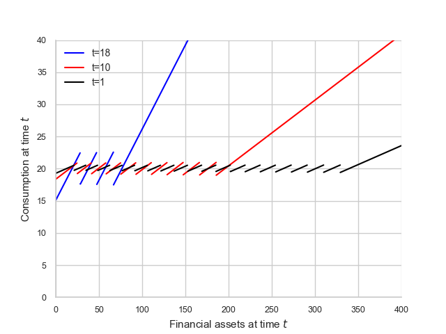

# Fast Upper-Envelope Scan (FUES) for Discrete-Continuous Dynamic Programming

Repository contains FUES module and examples fast upper-envelope scan (FUES) to clean sub-optimal local optima generated by endogenous grid methods (EGM) in discrete-continuous dynamic programming models.

See `slides....pdf` for overview of upper envelope scan. 

## Example use of FUES

Suppose we have the following arrays: an unrefined endogenous grid `x_hat`, the value correspondence on the unrefined grid `v_hat` 
and two policy functions, `policy_1` and `policy_2_hat`.

```
from FUES.FUES import FUES

x_clean, vf_clean, policy_1_clean, policy_2_clean, dela_clean \
        = FUES(x_hat, v_hat, policy_1_hat, policy_2_hat, dela, LB = 10, m_bar = 0.1, endog_mbar = True)
```

In the above:
- `x_hat` is the unrefined endogenous grid
- `v_hat` is the value correspondence on the unrefined grid
- `policy_1_hat` is the first policy function
- `policy_2_hat` is the second policy function
- `dela` is the derivative of the second policy function
- `LB` is the number of steps to take in the forward and backward scans
- `m_bar` is the maximum possible gradient of the policy function
- `endog_mbar` is a boolean indicating whether the cut off gradient used by FUES is endogenously determined using dela

The derivative of time t policy function can be calculated using the implicit function theorem and the Euler equation (see Appendix A of the latest working paper).  

It is also possible to set endog_mbar = False and set m_bar = $\bar{L}$ where $\bar{L}$ is the maximum possible gradient of the policy function. 

 **_NOTE:_** Recall that given a stochastic sequence of discrete choices, policy functions will have bounded MPCs: $\bar{L}<\infty$. 

When `m_bar` is False, dela is not used and the cut off gradient is set to m_bar (pass in a dummy array for dela).

Note: FUES detects jumps in the the second policy, policy_2_hat. 

## Application 1 (Retirement Choice)

Run the baseline timings, performance and plots. 

```
python3 scripts/retirement_plot.py
```

Table of results:

| Method | Euler Error    | Avg. upper env. time (ms) |
|--------|----------------|---------------------------|
| RFC    | -1.535907      | 11.572099                 |
| FUES   | -1.535912      | 0.813305                  |
| DCEGM  | -1.535847      | 5.644548                  |


Run full timings across grid sizes and delta, set `run_performance_tests = True` in main block of `retirement_plot.py`. 

Table of performance saved in `results/retirement_timings.tex`.

### Plots 


Consumption policy function generated using Ishkakov et al (2017) params and no smoothing:



Upper envelope generation using FUES and Ishkakov et al (2017) params (age 17):


