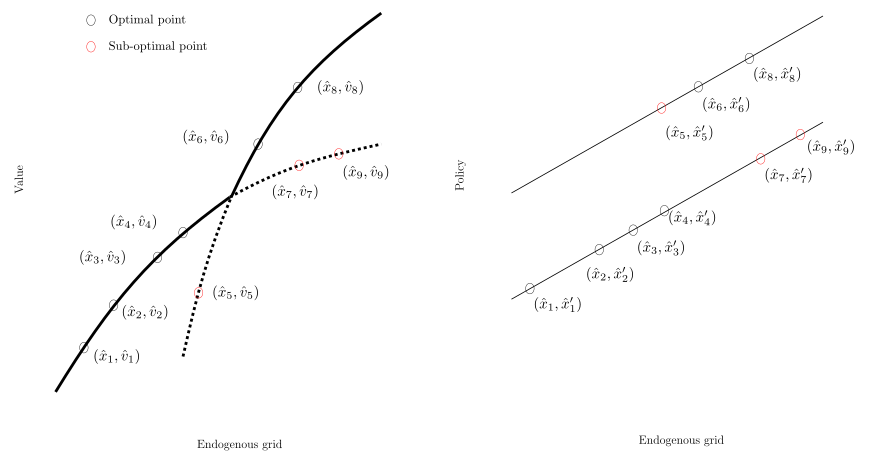

# How FUES Works

## The problem in one picture

In discrete-continuous problems, the Euler equation delivers a **value correspondence** rather than a globally optimal value function. After EGM, we therefore have candidate points on a non-uniform endogenous grid: some lie on the upper envelope, while others solve only a local first-order condition and are sub-optimal. FUES recovers the upper envelope by scanning the sorted candidate points once from left to right.

  

---

## Why EGM produces sub-optimal points

!!! abstract "Setup"
    Consider a standard Bellman equation with a discrete choice \(d \in \{0, 1\}\) and a continuous choice \(c\):

    \[
    V_t(a) = \max_{c,\, d} \left\{ u(c) + \beta V_{t+1}^d(a') \right\}
    \]

    The continuation value \(V_{t+1}^d\) depends on the future discrete choice sequence. Each sequence yields a **concave** value function. The true \(V_t\) is the **upper envelope** of these concave functions.

When we invert the Euler equation via EGM, we obtain raw correspondence points \((\hat{x}_i, \hat{v}_i)\) together with an associated continuation or post-decision object \(\hat{x}_{e,i}\) (equivalently, the paper's current \(\hat{x}'_i\)). Economically, each smooth branch corresponds to a continuation value associated with a particular future sequence of discrete choices. The true decision value is the supremum of these branch-specific concave objects. EGM does not by itself select the globally dominant branch, so some candidate points satisfy the Euler equation while still lying below the upper envelope.

!!! tip "The key insight"
    Along a single branch, the continuation policy is smooth and the value correspondence is locally concave. A discontinuous policy jump can therefore only be consistent with the upper envelope if it occurs at or just after a crossing between branches. Geometrically, that means:
    
    - a **jump plus a concave right turn** signals a sub-optimal point
    - a **jump plus a convex left turn** signals that the scan has passed a crossing and the point should be retained

---

## The basic scan

Order the EGM outputs by the endogenous grid \(\hat{x}_i\). FUES then walks through the sorted candidate points and compares the secant slopes around a local triple:

\[
g_i = \frac{\hat{v}_i - \hat{v}_{i-1}}{\hat{x}_i - \hat{x}_{i-1}}, \qquad
g_{i+1} = \frac{\hat{v}_{i+1} - \hat{v}_i}{\hat{x}_{i+1} - \hat{x}_i}
\]

These secants tell us whether moving from \((\hat{x}_{i-1},\hat{v}_{i-1})\) to \((\hat{x}_i,\hat{v}_i)\) and then to \((\hat{x}_{i+1},\hat{v}_{i+1})\) creates a convex left turn or a concave right turn.

=== "Right turn: remove"

    If \(g_{i+1} < g_i\) (a concave right turn) **and** the continuation policy jumps by more than \(\bar{M}\):

    - the candidate \((\hat{x}_{i+1},\hat{v}_{i+1})\) cannot belong to the upper envelope
    - the point is associated with an inferior branch
    - **remove it** from the endogenous grid, value correspondence, and continuation-policy arrays

=== "Left turn: keep"

    If \(g_{i+1} > g_i\) (a convex left turn) at a policy jump:

    - the scan has passed a crossing between choice-specific value functions
    - the candidate is potentially on the upper envelope
    - **keep it** and, in the refined implementation, optionally attach an interpolated crossing point

---

## Jump detection

!!! info "What is a jump?"
    A "jump" occurs when the continuation-policy gradient between adjacent points exceeds a threshold \(\bar{M}\):

    \[
    \left| \frac{\hat{x}_{e,i+1} - \hat{x}_{e,i}}{\hat{x}_{i+1} - \hat{x}_i} \right| > \bar{M}
    \]

    Within a single branch, the continuation object is smooth and its slope is bounded. A large difference quotient therefore signals that adjacent endogenous points are associated with different future choice sequences.

**Setting \(\bar{M}\):** Use the maximum marginal propensity to save in your model. For standard consumption-savings problems, values between 1.0 and 2.0 work well. Results are not sensitive to the exact choice.

Alternatively, set `endog_mbar=True` to compute \(\bar{M}\) endogenously at each grid point.

---

## The algorithm

!!! example "FUES (basic scan)"

    1. Compute the raw EGM objects \(\hat{\mathbb{X}}_t\), \(\hat{\mathbb{V}}_t\), and \(\hat{\mathbb{X}}_{e,t}\)
    2. Set the jump-detection threshold \(\bar{M}\)
    3. Sort all candidate points by the endogenous grid \(\hat{\mathbb{X}}_t\)
    4. Starting from \(i=2\), compute the secants \(g_i\) and \(g_{i+1}\)
    5. Compute the policy difference quotient \(\left|\frac{\hat{x}_{e,i+1}-\hat{x}_{e,i}}{\hat{x}_{i+1}-\hat{x}_i}\right|\)
    6. If the policy quotient exceeds \(\bar{M}\) and \(g_{i+1}<g_i\), delete point \(i+1\)
    7. Otherwise retain the point, advance the scan, and continue until the grid is exhausted

### Forward and backward scans

The simple left-turn/right-turn rule is the core of FUES, but crossings can occur very close to sampled grid points. In such cases, a purely local three-point test may misclassify the first point after a crossing or fail to detect that a previously retained point has become dominated.

FUES therefore uses a small look-ahead / look-back window (`LB`, default 4):

- **Forward scan**: before deleting a point after a right turn, search to the right for a point that appears to lie on the same branch as the last retained point. If the tentative point dominates the secant joining those two same-branch points, it is retained as a post-crossing optimal point.
- **Backward scan**: after a left turn, search to the left for a point that appears to lie on the same branch as the new candidate. If the previously retained point is dominated by that secant, it is reclassified as sub-optimal.
- **Crossing interpolation**: once the relevant left and right segments have been identified, FUES can attach an approximate crossing point to the refined grid.

These refinements are local, inexpensive, and mainly matter near closely spaced crossings; they do not change the basic economic logic of the method.

---

## Complexity comparison

| Method | Time | Monotone policy? | Gradient info? | Note |
|--------|------|:---:|:---:|------|
| **FUES** | \(O(N)\) | -- | -- | Single scan, fixed look-back |
| DC-EGM | \(O(N \log N)\) | Required | -- | Segment detection + interpolation |
| RFC | \(O(Nk)\) | -- | Required | Nearest-neighbour search |
| NEGM | \(O(N \cdot \text{opt})\) | N/A | N/A | Numerical optimisation per point |

!!! success "FUES advantages"
    - **No monotonicity assumption** on the policy function
    - **No gradient information** required (unlike RFC)
    - **Linear time** with a small constant
    - **Simple to implement** — a single scan loop
    - **Compatible with Numba, JAX, and GPU** vectorisation

---

## References

- Dobrescu, L.I. and Shanker, A. (2025). "A fast upper envelope scan method for discrete-continuous dynamic programming."
- Carroll, C.D. (2006). "The method of endogenous gridpoints for solving dynamic stochastic optimization problems." *Economics Letters*, 91(3).
- Iskhakov, F. et al. (2017). "The endogenous grid method for discrete-continuous dynamic choice models with (or without) taste shocks." *Quantitative Economics*, 8(2).
- Druedahl, J. (2021). "A guide on solving non-convex consumption-saving models." *Computational Economics*, 58.
- Fella, G. (2014). "A generalized endogenous grid method for non-smooth and non-concave problems." *Review of Economic Dynamics*, 17(2).
